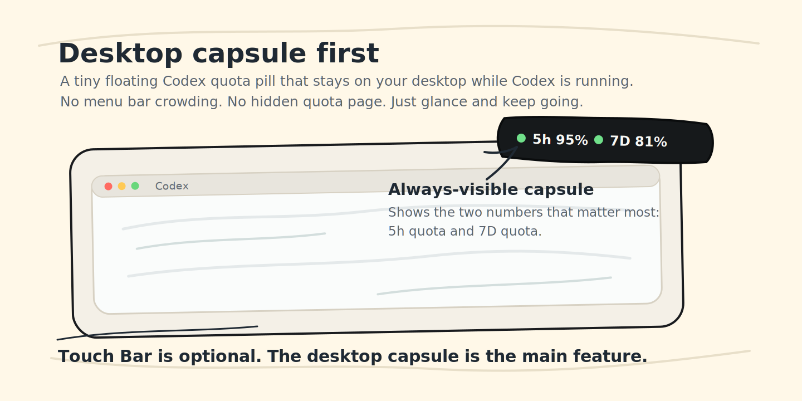
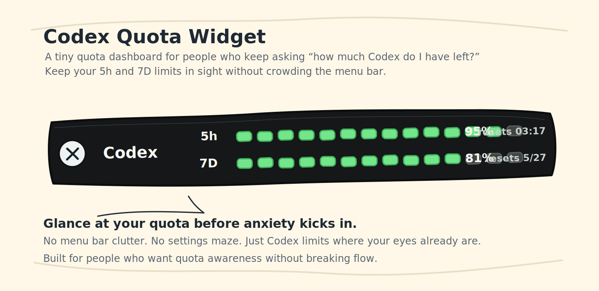
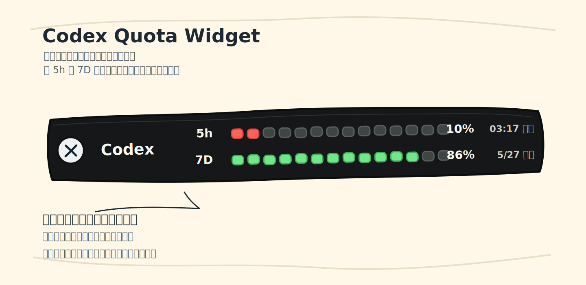

# Codex Quota Widget

> A tiny macOS helper that keeps your Codex quota visible before quota anxiety kicks in.  
> 主功能是桌面悬浮胶囊；Touch Bar 是给老款 MacBook Pro 用户的增强显示。



Optional Touch Bar preview:



Chinese UI preview:



## What It Does

Codex Quota Widget shows your Codex 5-hour quota and weekly quota in a floating desktop capsule. If your Mac has a Touch Bar, it can also mirror the same quota as a segmented bar.

- Main display: a floating desktop capsule that stays visible while Codex is running.
- Optional display: a persistent Touch Bar view with segmented quota bars, remaining percentages, reset times, and countdowns.
- Click the capsule to open a compact detail panel with reset times, data freshness, and plan information.

It is built for people who use Codex heavily and want the same kind of ambient awareness as a download speed widget or battery meter: glance once, keep working.

## 它解决什么问题

Codex 的剩余额度通常藏得比较深，需要点进本地模式里的额度状态才能看到。这个小工具的主功能是桌面悬浮胶囊，所以没有 Touch Bar 的 Mac 也能正常使用：

- 桌面悬浮胶囊：一直在屏幕边缘显示，不占菜单栏。
- Touch Bar 展示条：如果你的 Mac 有 Touch Bar，可以像电量条一样显示 `5h` 和 `7D`。
- 只在 Codex 运行时出现，Codex 退出后自动隐藏。
- 点击桌面胶囊可以展开详情，查看额度重置时间、数据更新时间和套餐信息。

## Highlights

- Native macOS helper written in `Swift + AppKit`.
- No menu bar clutter, no Dock icon, no Python GUI dependencies.
- Reads quota from Codex's local `app-server` first, then falls back to session logs.
- Shows the real `codex` quota bucket and avoids the misleading `codex_bengalfox` bucket.
- Keeps newer app-server snapshots from being overwritten by older session-log fallback data.
- Optional Touch Bar display for Touch Bar MacBook Pro models.
- Touch Bar modal close button is hidden so the quota view does not show a leading `x`.
- Claude Code can feed its quota into the same Touch Bar view through a statusLine bridge.
- Touch Bar copy can switch between English and Chinese from the capsule context menu.
- Command-line control for enabling/disabling the helper and running Touch Bar-only.
- Right-click shortcut to open Keyboard settings when Touch Bar needs `App Controls`.
- LaunchAgent support for silent login startup.

## 功能亮点

- 原生 `Swift + AppKit` 实现。
- 不占菜单栏，没有 Dock 图标。
- 优先通过 Codex 本机 `app-server` 读取真实额度，日志解析只作为备用。
- 只读取 `rateLimitsByLimitId.codex`，避免误读其他额度桶。
- 避免旧 session log 回退数据覆盖较新的 app-server 额度快照。
- Touch Bar 是可选增强，适合仍在使用 Touch Bar MacBook Pro 的用户。
- 右键胶囊可以在 English / 中文 Touch Bar 文案之间切换。
- 右键胶囊可以快速打开键盘设置，方便把 Touch Bar 切到 `App 控制`。
- 支持登录后后台自启，打开 Codex 后自动出现。

## Install

Clone the repo, then run:

```bash
./scripts/install_launch_agent.sh
```

This will:

- Build the native helper.
- Copy the binary to `~/.codex-quota-widget/bin`.
- Install a user-level LaunchAgent.
- Start the helper immediately.

To restart after making changes:

```bash
./scripts/restart_helper.sh
```

To uninstall:

```bash
./scripts/uninstall_launch_agent.sh
```

Command-line control:

```bash
./scripts/widgetctl.sh enable
./scripts/widgetctl.sh enable --touchbar-only
./scripts/widgetctl.sh disable
./scripts/widgetctl.sh capsule off
./scripts/widgetctl.sh capsule on
./scripts/widgetctl.sh providers both
./scripts/widgetctl.sh providers codex
./scripts/widgetctl.sh providers claude
./scripts/widgetctl.sh claude on
./scripts/widgetctl.sh claude off
./scripts/widgetctl.sh claude doctor
./scripts/widgetctl.sh pin on
./scripts/widgetctl.sh pin off
./scripts/widgetctl.sh status
```

### Claude Code quota (statusLine bridge)

`./scripts/widgetctl.sh claude on` points Claude Code's `statusLine.command` at
`scripts/claude_statusline_bridge.py` and sets `refreshInterval` so the data stays
fresh while Claude Code is idle. Whenever Claude Code refreshes its status line, the
bridge reads `rate_limits.five_hour` / `rate_limits.seven_day` from the payload and
writes them to `~/.codex-quota-widget/claude-code-snapshot.json`.

Important: **Claude Code only runs a statusLine command from its interactive terminal
UI.** The VS Code extension, headless (`claude -p`), and SDK modes do not invoke it, so
the snapshot is only produced while Claude Code is running in a terminal. `rate_limits`
itself only exists for Claude.ai Pro/Max accounts and appears after the first API
response in a session.

The Touch Bar **Claude segment auto-appears only while the snapshot is fresh** — i.e.
while you are actively using Claude Code in a terminal — and hides on its own about 30
seconds after you stop (no `--%` placeholder is shown). Opening Claude Code alone is not
enough: send one message to activate `rate_limits`. The `refreshInterval` heartbeat then
keeps the segment alive while the session stays open.

Note that the numbers only refresh when the terminal session that drives the bridge
makes an API call (i.e. when you send a message in that terminal). Usage from the Claude
app or the VS Code extension is account-wide but is not pushed to an idle terminal
session; the next message in the terminal catches up to the latest account-wide value.

If Claude quota does not show up, diagnose the data interface with:

```bash
./scripts/widgetctl.sh claude doctor
```

It reports whether the statusLine is wired correctly, when the bridge last ran (from the
`~/.codex-quota-widget/claude-code-bridge-debug.json` breadcrumb), and whether the
snapshot is fresh.

## 安装使用

进入项目目录后运行：

```bash
./scripts/install_launch_agent.sh
```

安装完成后：

- 登录 macOS 后 helper 会静默启动。
- 没打开 Codex 时不会显示任何东西。
- 打开 Codex 后，桌面胶囊和 Touch Bar 会自动出现。
- 切到其他 App 时，Touch Bar 会自动交还给前台 App。
- 关闭 Codex 后，它们会自动隐藏。

如果只想要 Touch Bar，不想显示桌面胶囊：

```bash
./scripts/widgetctl.sh enable --touchbar-only
```

之后也可以用命令开关：

```bash
./scripts/widgetctl.sh capsule off
./scripts/widgetctl.sh capsule on
./scripts/widgetctl.sh providers both
./scripts/widgetctl.sh providers codex
./scripts/widgetctl.sh providers claude
./scripts/widgetctl.sh disable
```

如果还想支持 Claude Code：

```bash
./scripts/widgetctl.sh claude on
```

这个命令会把 Claude Code 的 `statusLine` 指向本项目的 bridge 脚本，并设置 `refreshInterval`，让 Claude Code 空闲时数据也能保持新鲜；Claude Code 刷新 statusline 时，bridge 会把 `rate_limits.five_hour` / `rate_limits.seven_day` 写到 `~/.codex-quota-widget/claude-code-snapshot.json`。Touch Bar 默认左侧显示 Claude，右侧显示 Codex；也可以用 `providers codex`、`providers claude`、`providers both` 选择显示哪一侧。

重要：**Claude Code 只有在终端交互界面里才会执行 statusLine 命令。** VS Code 插件、`claude -p` 无界面模式、SDK 模式都不会触发，所以只有在终端里运行 Claude Code 时才会写出快照。`rate_limits` 仅对 Claude.ai Pro/Max 账号有效，并且要在会话里产生第一次 API 响应后才会出现。

Touch Bar 上的 **Claude 区块只在快照新鲜时（即你正在终端里使用 Claude Code 时）才会出现**，停止使用约 30 秒后自动隐藏（不再显示 `--%` 占位）。光打开 Claude Code 还不够：发一条消息才会激活 `rate_limits`，之后 `refreshInterval` 心跳会在会话开着期间一直把区块续命显示。

注意：数值只有在"驱动 bridge 的那个终端会话自己发起 API 调用时"（即你在该终端发消息）才会刷新。你在 Claude app 或 VS Code 插件里的消耗虽然是账号级的，但不会推送给挂着的空闲终端会话；等你下次在终端发消息时会一次性追平到账号级最新值。

如果 Claude 额度一直读不到，可以用下面的命令体检数据接口：

```bash
./scripts/widgetctl.sh claude doctor
```

它会报告 statusLine 是否接好、bridge 最近一次运行的时间和结果（来自 `~/.codex-quota-widget/claude-code-bridge-debug.json` 面包屑），以及快照是否新鲜。

如果 Touch Bar 被系统关闭按钮隐藏，可以右键桌面胶囊，选择 `显示 Touch Bar` 重新显示。

如果想切换 Touch Bar 文案语言，可以右键胶囊，选择 `Language: English` 或 `Language: 中文`。

如果 Touch Bar 一直不显示，请检查 macOS 设置：`系统设置` -> `键盘` -> `触控栏设置` -> `触控栏显示`，需要选择 `App 控制`。也可以右键桌面胶囊，选择 `打开 Touch Bar 设置...` 快速跳到键盘设置页。

没有 Touch Bar 的 Mac 会继续使用桌面悬浮胶囊，不需要二次开发。

## Touch Bar Setup

If the Touch Bar view does not appear, check macOS settings first:

- Open `System Settings` -> `Keyboard` -> `Touch Bar Settings`.
- Set `Touch Bar shows` to `App Controls`.
- You can also right-click the desktop capsule and choose `打开 Touch Bar 设置...` to open Keyboard settings quickly.

This is a macOS-level setting. The widget can show Touch Bar content, but it cannot force macOS to switch away from Control Strip-only modes.

### Pin to the Touch Bar

By default the widget yields the Touch Bar to whatever app you switch to (the quota view
minimizes to a Control Strip button you can tap to bring it back). If you want it to stay
on the Touch Bar regardless of the foreground app, pin it:

```bash
./scripts/widgetctl.sh pin on    # keep the quota view on the Touch Bar across app switches
./scripts/widgetctl.sh pin off   # yield to the foreground app (default)
```

When pinned, the widget re-asserts itself onto the Touch Bar each time you switch apps.
（固定后，切换到任何 App，控件都会重新占据 Touch Bar，不再被前台 App 让走；`pin off` 恢复默认。）

## Manual Run

For local testing:

```bash
./scripts/run_local.sh
```

To verify the quota data source:

```bash
./scripts/build.sh
./bin/CodexQuotaWidget --once
```

If the output contains `"sourceFileName": "Codex app-server"`, the primary data source is working.

## 手动验证

本地调试可以运行：

```bash
./scripts/run_local.sh
```

检查数据源：

```bash
./scripts/build.sh
./bin/CodexQuotaWidget --once
```

如果输出里看到 `"sourceFileName": "Codex app-server"`，说明已经通过 Codex 本机服务拿到了真实额度。

## Share With Others

This tool is distributed as source and built locally on each machine, which avoids
code-signing / Gatekeeper prompts and works on both Apple Silicon and Intel.

Requirements for the recipient:

- macOS with Xcode Command Line Tools (`xcode-select --install`) so `swiftc` is available.
- A Touch Bar MacBook Pro is needed to see the Touch Bar quota bars (the floating capsule
  works on any Mac). Note the Claude quota is shown on the Touch Bar only.

Two ways to share:

1. **Via GitHub** — push your changes, then the recipient runs:

   ```bash
   git clone https://github.com/wendybzhang/codex-quota-widget.git
   cd codex-quota-widget
   ./scripts/install_launch_agent.sh
   ```

2. **Via a file** — produce a self-contained archive (no git or GitHub needed) and send it:

   ```bash
   ./scripts/package.sh        # writes dist/codex-quota-widget-<timestamp>.tar.gz
   ```

   The recipient then runs:

   ```bash
   tar -xzf codex-quota-widget-<timestamp>.tar.gz
   cd codex-quota-widget
   ./scripts/install_launch_agent.sh
   ```

To turn on Claude quota after installing, the recipient runs `./scripts/widgetctl.sh claude on`
and uses Claude Code in a terminal (see the statusLine section above).

## 分享给别人

本工具以源码分发、在每台机器本地编译，这样可以避免代码签名 / Gatekeeper 弹窗，并且同时兼容
Apple Silicon 和 Intel。

对方需要满足：

- macOS，并安装 Xcode 命令行工具（`xcode-select --install`），保证有 `swiftc`。
- 想看 Touch Bar 额度条需要带 Touch Bar 的 MacBook Pro（桌面悬浮胶囊任何 Mac 都能用）。注意
  Claude 额度只在 Touch Bar 显示。

两种分享方式：

1. **走 GitHub** —— 你先把改动推上去，对方执行：

   ```bash
   git clone https://github.com/wendybzhang/codex-quota-widget.git
   cd codex-quota-widget
   ./scripts/install_launch_agent.sh
   ```

2. **发文件** —— 打一个自包含压缩包（不需要 git / GitHub）发给对方：

   ```bash
   ./scripts/package.sh        # 生成 dist/codex-quota-widget-<时间戳>.tar.gz
   ```

   对方解压后执行：

   ```bash
   tar -xzf codex-quota-widget-<时间戳>.tar.gz
   cd codex-quota-widget
   ./scripts/install_launch_agent.sh
   ```

安装后想启用 Claude 额度，对方执行 `./scripts/widgetctl.sh claude on`，并在终端里使用 Claude Code
（见上文 statusLine 说明）。

## Notes

- Touch Bar display uses macOS private Touch Bar APIs. If your Mac does not have Touch Bar, or the API is unavailable, the floating capsule still works.
- Touch Bar display also depends on the macOS `Touch Bar shows: App Controls` setting.
- This is an unofficial personal tool and is not affiliated with OpenAI.
- The Codex internal app-server protocol may change in future releases.
- Released under the MIT License.

## 注意事项

- Touch Bar 展示使用了 macOS 私有 Touch Bar API；没有 Touch Bar 的 Mac 或系统不支持时，桌面胶囊仍然可用。
- Touch Bar 展示也依赖 macOS 的 `触控栏显示：App 控制` 设置。
- 这是一个非官方个人工具，不代表 OpenAI。
- Codex 本机 `app-server` 的内部协议未来可能变化。
- 项目使用 MIT License 开源。

## Credits

The Touch Bar quota display idea is inspired by 小红书 creator **@Fly**，小红书 ID：`26872565825`.  
This project adapts that idea into a local floating capsule plus Touch Bar helper.

## 致谢

Touch Bar 额度条的创意来自小红书作者 **@Fly**，小红书 ID：`26872565825`。  
这个项目是在原有桌面胶囊小工具基础上的本地化改造与实现。
